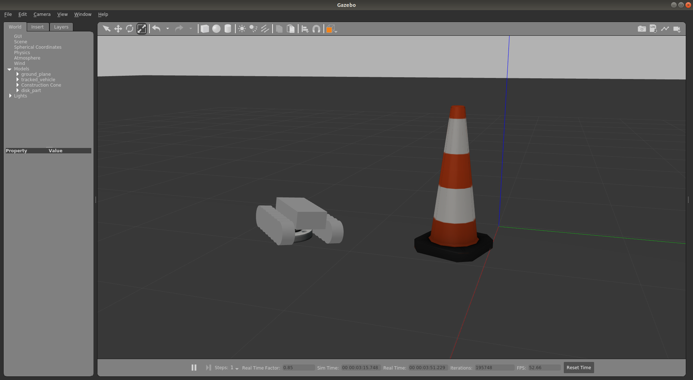
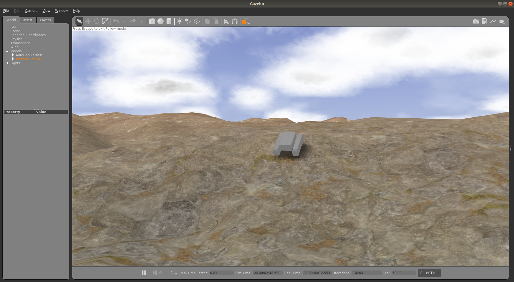
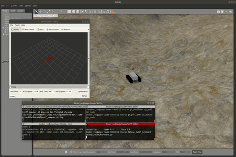

# Gazebo Tracked Vehicle Simulator

Simple model and world for simulate tracked vehicle.

## 1. tracked vehicle model

Xacro files converted from [gazebo tracked-vehicle demo](https://github.com/osrf/gazebo/blob/gazebo11/worlds/tracked_vehicle_wheeled.world).

Launch robot in empty world with `roslaunch tracked_description empty_world.launch`.

You can control robot with keyboard `WADS`.

### How to convert sdf into xacro

1. Remove all `plugin` tags in **sdf**
2. Convert joint and link tags in **sdf** to **urdf** format with [pysdf](https://github.com/andreasBihlmaier/pysdf) 
3. Add `plugin` to **urdf** with gazebo tags
4. Convert **urdf** to **xacro** (by hand) for the convenience of adjusting model

## 2. autogen_terrain 

This terrain world file is generated from [terrain_generator](https://github.com/Sarath18/terrain_generator).

Move `autogen_terrain` world model to `~/.gazebo/models ` with script `setup.bash`。

Launch robot in terrain world with `roslaunch tracked_description mountain_world.launch`.

You can control robot with keyboard `WADS`.

## 3. tracked_gazebo_plugins

transport twist cmd: ros->gazebo.

based on [gazebo_plugins/gazebo_ros_diff_drive.cpp](https://github.com/ros-simulation/gazebo_ros_pkgs/blob/kinetic-devel/gazebo_plugins/src/gazebo_ros_diff_drive.cpp)

modify [WheelTrackedVehiclePlugin](https://github.com/osrf/gazebo/blob/gazebo9_9.13.1/plugins/WheelTrackedVehiclePlugin.cc)to solve slip issues.

## 4. ground truth & stereo camera & imu

ground truth publisher is implemented in `gt_publisher_node.cpp`.

modify `libgazebo_ros_p3d` for eliminating bias of coordinate.

## 5. rtabmap/vins fusion support 

`roslaunch rtabmap_ros euroc_datasets.launch args:="Odom/Strategy 9 OdomVINS/ConfigPath ~/catkin_vins/src/VINS-Fusion/config/euroc/euroc_stereo_config.yaml" MH_seq:=true raw_images_for_odom:=true`

